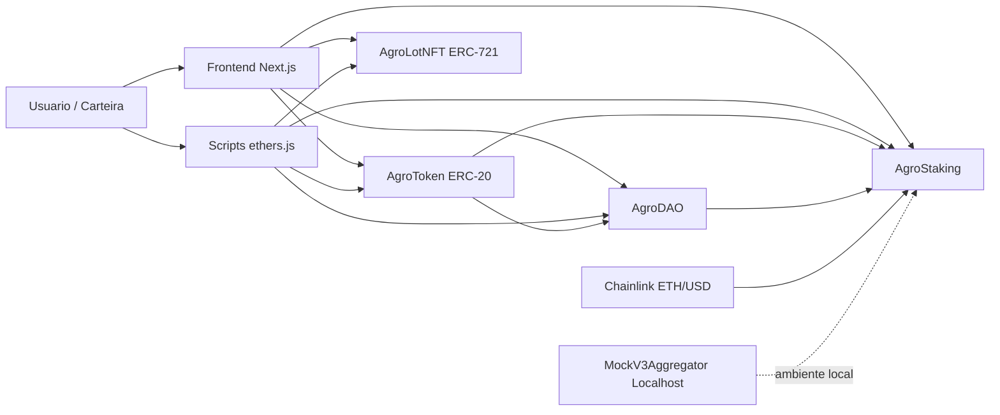
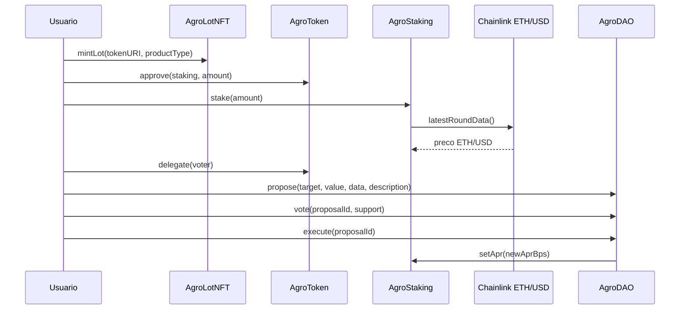

# Arquitetura da AgroChain

## 1. Problema que o protocolo resolve

A AgroChain propõe um MVP para rastreabilidade e governança de cadeias agro usando Web3.
O problema central é a dificuldade de registrar lotes de produção de forma auditável, criar incentivos econômicos para participação no ecossistema e permitir que parâmetros do protocolo sejam ajustados de forma transparente.

Na prática, o MVP conecta quatro necessidades:

- registrar lotes agro como ativos digitais verificáveis
- incentivar participação com um token utilitário e recompensas de staking
- permitir decisões coletivas sobre parâmetros do sistema
- consumir dados externos confiáveis para ajustar regras do protocolo

## 2. Visão geral da solução

O protocolo é composto por quatro contratos principais e uma camada Web3 para operação:

- `AgroToken.sol`: token ERC-20 do ecossistema
- `AgroLotNFT.sol`: NFT ERC-721 para representar lotes agro
- `AgroStaking.sol`: contrato de staking com recompensa e leitura de oracle
- `AgroDAO.sol`: governança simplificada para propostas, votação e execução
- `scripts/` e `frontend/`: camada de integração Web3 para demonstrar uso do protocolo

O fluxo principal do MVP é:

1. o usuário emite um NFT de lote
2. o usuário utiliza AGRO para staking
3. o staking calcula recompensas com suporte de dados externos via Chainlink
4. a comunidade delega votos em AGRO e interage com a DAO
5. propostas aprovadas podem alterar parâmetros autorizados do protocolo, como APR do staking

## 3. Componentes da arquitetura

### 3.1 AgroToken

Responsabilidades:

- representar o token utilitário do protocolo
- permitir transferências e uso econômico no staking
- suportar delegação e histórico de votos para governança
- aplicar papéis administrativos e pausa quando necessário

Tecnologias e padrões:

- OpenZeppelin `ERC20`
- OpenZeppelin `ERC20Permit`
- OpenZeppelin `ERC20Votes`
- OpenZeppelin `AccessControl`
- OpenZeppelin `Pausable`

### 3.2 AgroLotNFT

Responsabilidades:

- representar um lote agro como NFT único
- armazenar URI de metadados do lote
- associar o lote a um tipo de produto
- permitir controle de mint por papel administrativo

Tecnologias e padrões:

- OpenZeppelin `ERC721`
- OpenZeppelin `ERC721URIStorage`
- OpenZeppelin `AccessControl`
- OpenZeppelin `Pausable`

### 3.3 AgroStaking

Responsabilidades:

- receber depósitos de AGRO
- acumular recompensas de staking
- permitir `stake`, `claim` e `unstake`
- ajustar APR com base em lógica interna e leitura do oracle
- proteger operações críticas contra reentrancy

Tecnologias e padrões:

- `SafeERC20`
- `AccessControl`
- `Pausable`
- `ReentrancyGuard`
- `AggregatorV3Interface` compatível com Chainlink

### 3.4 AgroDAO

Responsabilidades:

- criar propostas de atualização
- registrar votação com base em saldo delegado via `ERC20Votes`
- executar propostas aprovadas
- restringir alvos executáveis para reduzir risco do MVP

Tecnologias e padrões:

- `AccessControl`
- `Pausable`
- `ReentrancyGuard`
- integração com `IVotes` / `ERC20Votes`

### 3.5 Oracle

O protocolo usa Chainlink ETH/USD em Sepolia para fornecer dado externo confiável.
No ambiente local, o deploy usa `MockV3Aggregator` para permitir testes e demonstrações sem depender da rede pública.

Objetivo no MVP:

- demonstrar como preço externo pode influenciar a lógica de recompensa do staking

### 3.6 Camada Web3

O projeto possui duas formas de integração:

- `scripts/` com `ethers.js` para operação direta e repetível
- `frontend/` em Next.js para demonstração visual do fluxo

Operações disponíveis:

- mint de NFT
- stake de AGRO
- claim de recompensas
- delegação de votos
- criação de proposta
- votação
- execução de proposta

## 4. Justificativa dos padrões ERC

### 4.1 Por que ERC-20

O `ERC-20` foi escolhido para o token AGRO porque ele representa bem um ativo fungível usado como unidade econômica do protocolo.

Vantagens:

- adequado para staking e distribuição de recompensas
- amplamente compatível com carteiras e ferramentas Web3
- integração simples com OpenZeppelin
- permite extensão com `ERC20Votes` para governança

### 4.2 Por que ERC-721

O `ERC-721` foi escolhido porque cada lote agro precisa ser único e rastreável individualmente.

Vantagens:

- cada lote possui identidade própria
- combina bem com URI de metadados
- facilita prova de procedência e organização por item
- é suficiente para o MVP sem a complexidade adicional de um `ERC-1155`

### 4.3 Por que não ERC-1155 neste MVP

Embora `ERC-1155` seja útil para múltiplos tipos de ativos, o MVP precisa demonstrar lotes individualizados, com rastreabilidade clara por unidade emitida.
Por isso, `ERC-721` oferece uma modelagem mais direta para a apresentação acadêmica.

## 5. Fluxo funcional do protocolo

### Fluxo de rastreabilidade

1. um endereço com permissão de mint chama `mintLot`
2. o contrato `AgroLotNFT` cria um NFT único
3. a URI de metadados e o tipo do produto ficam associados ao lote

### Fluxo de staking

1. o usuário recebe ou possui AGRO
2. o usuário aprova o contrato `AgroStaking`
3. o usuário executa `stake`
4. recompensas passam a acumular ao longo do tempo
5. o usuário pode usar `claim` ou `unstake`

### Fluxo de governança

1. o usuário delega votos do AGRO
2. o usuário cria proposta na `AgroDAO`
3. a DAO calcula poder de voto com snapshot histórico
4. usuários votam a favor ou contra
5. proposta aprovada pode ser executada dentro dos alvos permitidos

### Fluxo de oracle

1. `AgroStaking` consulta o feed ETH/USD
2. o contrato valida consistência do dado retornado
3. a leitura do oracle influencia o cálculo de APR/recompensa

## 6. Diagrama de arquitetura

## 7. Diagrama de fluxo principal

## 8. Decisões arquiteturais do MVP

- uso de OpenZeppelin para reduzir risco de implementação básica
- uso de `ERC20Votes` para snapshot histórico de governança
- uso de DAO simplificada para manter escopo compatível com o prazo
- uso de Chainlink em Sepolia e mock local para facilitar testes e demo
- uso de frontend mínimo e scripts para cobrir integração Web3 com baixo custo de implementação

## 9. Limitações atuais

- a DAO não usa stack completa de governança com `Governor` e `Timelock`
- a modelagem de lotes ainda é simples e pode evoluir com metadados mais ricos
- a regra de staking foi desenhada para fins acadêmicos e de demonstração
- a integração com oracle está focada em um caso de uso ilustrativo

## 10. Resumo

A AgroChain foi estruturada como um protocolo Web3 modular e demonstrável, cobrindo token, NFT, staking, governança, oracle e integração Web3. A arquitetura foi desenhada para atender ao escopo da disciplina com foco em clareza, segurança básica e facilidade de demonstração em localhost e Sepolia.
