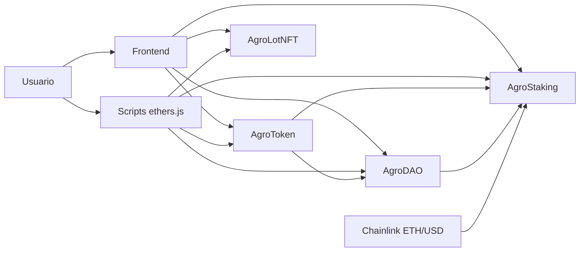

# Arquitetura - AgroChain

## 1. Problema

A AgroChain propõe um MVP para:

- registrar lotes agro de forma auditável
- criar incentivos com staking
- permitir ajustes de protocolo por governança on-chain

## 2. Componentes

- `AgroToken.sol`: ERC-20 AGRO com `ERC20Votes`
- `AgroLotNFT.sol`: ERC-721 para lotes agro
- `AgroStaking.sol`: staking com recompensa e oracle
- `AgroDAO.sol`: proposta, voto e execução
- `frontend/`: interface Web3
- `scripts/`: automação com `ethers.js`

## 3. Justificativa dos padrões

- `ERC-20`: adequado para ativo fungível, staking e governança
- `ERC-721`: adequado para lotes únicos com metadados próprios

## 4. Fluxo principal

1. emitir NFT de lote
2. fazer staking de AGRO
3. delegar votos
4. criar proposta
5. votar
6. executar proposta aprovada

## 5. Oracle

O staking usa Chainlink ETH/USD em Sepolia para influenciar a lógica de APR/recompensa.

## 6. Diagrama

## 7. Resumo

A AgroChain foi desenhada como um MVP Web3 simples e demonstrável, cobrindo token, NFT, staking, governança, oracle e integração Web3 em Sepolia.
